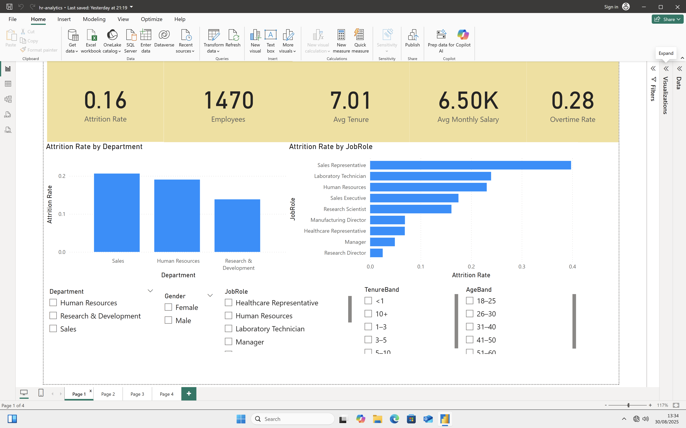
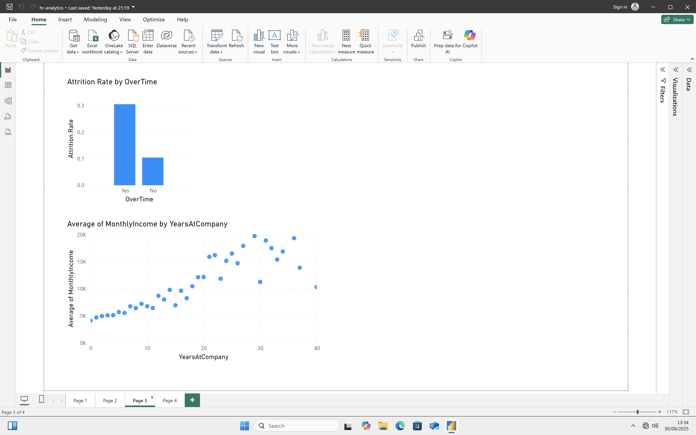
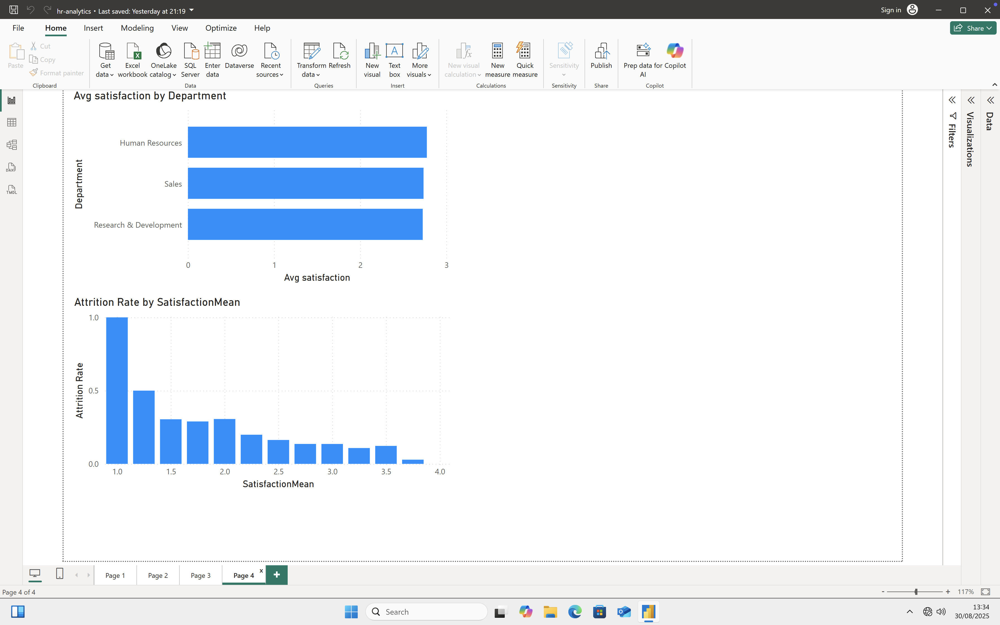

# 👩‍💼 HR Analytics Dashboard & Employee Attrition Analysis

## 📌 Project Overview
Employee attrition is one of the biggest challenges for HR teams, as it directly impacts business continuity and employee morale.  
This project combines **Exploratory Data Analysis (EDA)** in Python and an **interactive Power BI dashboard** to analyze attrition trends and identify key factors influencing employee turnover.

The dataset is the popular **HR Analytics dataset (IBM HR Attrition)**, containing 1470 employee records with demographic, job role, and satisfaction-related attributes.

---

## 🛠️ Tools & Technologies
- **Python (Jupyter Notebook)** → Data cleaning, EDA, and preprocessing  
  - Libraries: `pandas`, `numpy`, `seaborn`, `matplotlib`  
- **Power BI** → Interactive dashboards and KPI tracking  
- **Dataset** → HR Employee Attrition Dataset (IBM Sample Dataset)  

---

## 📊 Dashboard Overview
The dashboard consists of **4 Pages**:

### 🔹 Page 1 – KPIs & Attrition by Job Role/Department
- **Key Metrics**: Attrition Rate (16%), Total Employees (1470), Avg Tenure (7 years), Avg Monthly Salary (6.5K), Overtime Rate (28%)  
- **Attrition by Department** → Highest in Sales  
- **Attrition by Job Role** → Sales Representatives & Lab Technicians most affected  
- **Filters**: Department, Gender, Job Role, Tenure Band, Age Band
- 

---

### 🔹 Page 2 – Demographics & Education
- **Employees by Age Band & Gender**  
- **Attrition Rate by Education Field** → HR & Technical Degrees show higher attrition  
- **Department-wise Attrition Table**
-   

---

### 🔹 Page 3 – Overtime & Income
- **Attrition Rate by Overtime** → Overtime workers leave more frequently  
- **Monthly Income vs Years at Company** → Positive correlation, higher tenure = higher salary
-   

---

### 🔹 Page 4 – Job Satisfaction & Attrition
- **Average Satisfaction by Department**  
- **Attrition Rate by Satisfaction Score** → Lower satisfaction = higher attrition
-   

---

## 📈 EDA Highlights (Jupyter Notebook)
The Jupyter Notebook (`hr_analytics.ipynb`) covers:
1. **Data Cleaning & Preprocessing**  
2. **Univariate Analysis** → Distribution of age, tenure, salary, overtime  
3. **Bivariate Analysis** → Attrition vs Department, Gender, Education, Job Role  
4. **Key Insights**:  
   - Younger employees (18–30) leave more often  
   - Overtime strongly linked to attrition  
   - Job satisfaction has a direct impact on retention  
   - Sales & HR departments face higher attrition  
